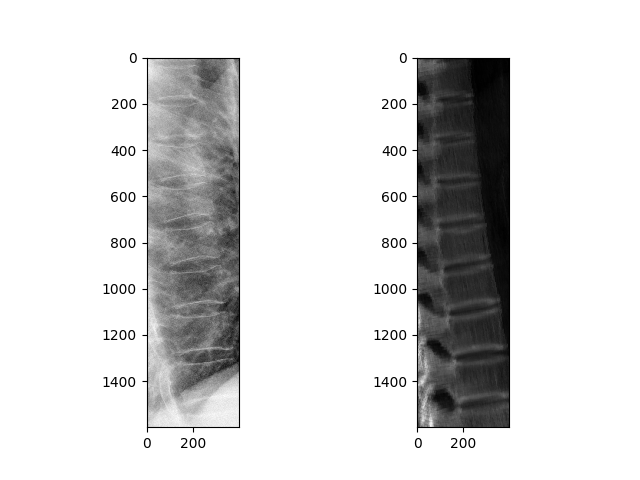

# Opt-GO-3D-2D-Registration
浙大机器人交叉创新实践课程参考代码：基于CMA-ES算法和梯度方向测度（GO）的3D/2D医学图像配准算法（Python实现）

### 一、安装依赖
* Python 3
* Numpy
* ITK 5.0
* pycma
* Matplotlib
* Cython
* CUDA >= 9.0
* PyTorch >= 1.1 

推荐使用Anaconda创建Python虚拟环境运行代码
Anaconda下载地址：https://www.anaconda.com/products/individual

创建虚拟环境：`conda create -n your_env_name python=3.7`

激活虚拟环境：`conda activate your_env_name`

退出虚拟环境：`conda deactivate`

激活虚拟环境后，安装依赖：`pip install -r requirements.txt`

注意：CUDA和PyTorch根据内置NVIDIA显卡版本自行安装
## 二、3D/2D Registration
该模块实现Opt-GO配准算法，即本课程基础实践作业的参考结果
### 运行测试程序

在项目根目录下，运行：

```bash
cd 3D_2D_Registration/test
python 3D_2D_Registration_Multiview.py
```
注意：`3D_2D_Registration_Multiview.py`中测试用例的路径需自行修改
### 运行结果


左侧图片是术中采集的侧位（X光）胸片，右侧图片是配准后的术前胸腔CT产生的Digitally Reconstructed Radiography（DRR）

## 三、Digitally Reconstructed Radiography（DRR）
该模块包含：
* 数字重建透视图生成（GPU加速）
* 梯度方向测度计算（GPU加速）

### 编译方法
在项目根目录下，运行：

```bash
cd CUDA_DRR_Metric
./cuda_debugger.sh
```
注意：`cuda_debugger.sh`文件中的路径需要自行修改；编译出的动态链接库（.so文件）使用方法参考3D/2D Registration模块源码；Windows下编译需要安装可视化cmake工具和Visual Studio（推荐使用VS2017），编译完成后得到的动态链接库为.pyd文件

## 四、参考文献
3D–2D image registration for target localization in spine surgery: investigation of similarity metrics providing robustness to content mismatch（T De Silva. 2016）

Fast calculation of the exact radiological path for a three-dimensional CT array（Siddon. 1985）

Accelerated ray tracing for radiotherapy dose calculations on a GPU（Greef. 2009）